# vedit — Architecture & Developer Documentation

> A modular, terminal-based Vim-like text editor written in C.

---

## Table of Contents

1. [Project Overview](#1-project-overview)
2. [Directory Structure](#2-directory-structure)
3. [Module Dependency Graph](#3-module-dependency-graph)
4. [Data Model](#4-data-model)
5. [Editor Modes & State Machine](#5-editor-modes--state-machine)
6. [Startup & Main Loop](#6-startup--main-loop)
7. [Input Pipeline](#7-input-pipeline)
8. [Normal Mode Key Handling](#8-normal-mode-key-handling)
9. [Insert Mode Key Handling](#9-insert-mode-key-handling)
10. [Command Mode Processing](#10-command-mode-processing)
11. [Buffer / Core Operations](#11-buffer--core-operations)
12. [UI Rendering Pipeline](#12-ui-rendering-pipeline)
13. [File I/O Flow](#13-file-io-flow)
14. [Build System](#14-build-system)
15. [Function Reference](#15-function-reference)

---

## 1. Project Overview

**vedit** is a lightweight, terminal-based text editor that mimics core Vim functionality. It is implemented in pure C (C99) and targets POSIX-compatible terminals via raw-mode terminal I/O and ANSI escape sequences.

Key characteristics:
- **Modal editing**: Normal, Insert, Command, and Help modes
- **Vim-like keybindings**: `h/j/k/l`, `dd`, `0/$`, `:w/:q/:wq`
- **Raw terminal I/O** via `termios`
- **Append-buffer rendering** for flicker-free redraws
- **Nix + Make build system** for reproducible builds

---

## 2. Directory Structure

```
vedit/
├── main.c                  # Entry point (delegates to src/)
├── Makefile                # Build rules
├── flake.nix               # Nix development environment
├── include/                # Public header files
│   ├── editor.h            # Global state & data types
│   ├── core.h              # Buffer manipulation API
│   ├── input.h             # Key reading & mode dispatch API
│   ├── ui.h                # Terminal & rendering API
│   ├── utils.h             # File I/O & utility API
│   └── commands.h          # Command mode API
├── src/
│   ├── main.c              # Actual main() implementation
│   ├── core/
│   │   ├── buffer.c        # Row-level buffer operations
│   │   └── state.c         # Editor state initialisation
│   ├── input/
│   │   ├── keyboard.c      # editorReadKey() — raw key reading
│   │   ├── modes.c         # editorProcessKeypress() — mode dispatch
│   │   ├── normal.c        # normalModeProcessKey() + editorMoveCursor()
│   │   ├── insert.c        # insertModeProcessKey()
│   │   └── help.c          # helpModeProcessKey()
│   ├── ui/
│   │   ├── render.c        # Screen drawing, scroll, status/message bars
│   │   └── terminal.c      # enableRawMode / disableRawMode / getWindowSize
│   ├── commands/
│   │   └── prompt.c        # editorPrompt() + commandModeProcess()
│   └── utils/
│       ├── file.c          # editorOpen() / editorSave() / editorRowsToString()
│       ├── utils.c         # abAppend() / abFree()
│       └── error.c         # die()
└── bin/
    └── vedit               # Compiled binary (after make)
```

---

## 3. Module Dependency Graph

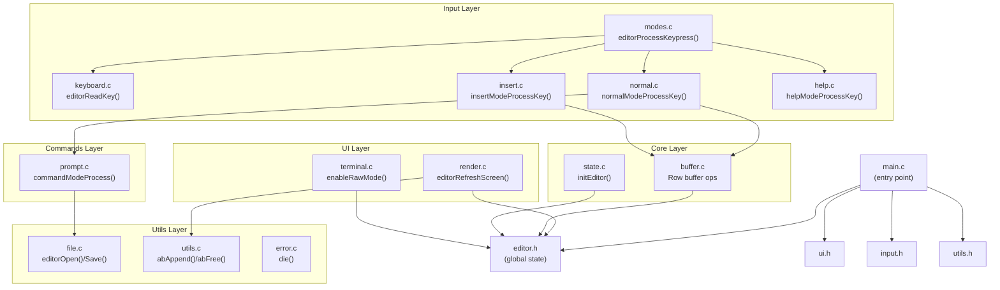

---

## 4. Data Model

### Core structs and enums

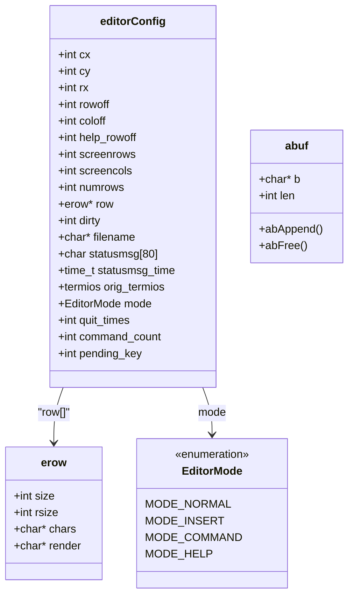

---

## 5. Editor Modes & State Machine

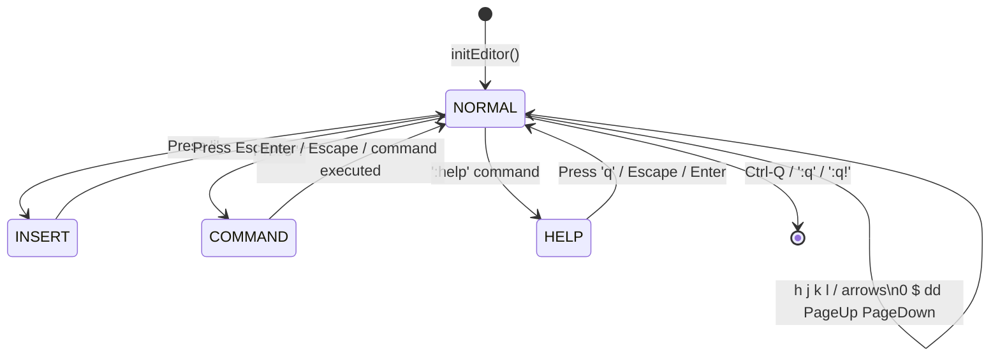

### Mode Responsibilities

| Mode | File | Behaviour |
|---|---|---|
| `MODE_NORMAL` | `normal.c` | Navigation, `dd`, numeric prefix, trigger mode switches |
| `MODE_INSERT` | `insert.c` | Typing characters, Backspace, Enter, Escape to exit |
| `MODE_COMMAND` | `prompt.c` | Reads a `:cmd` string, dispatches `w`, `q`, `wq`, `q!`, `help` |
| `MODE_HELP` | `help.c` | Scrolls a built-in help text, any exit key returns to Normal |

---

## 6. Startup & Main Loop

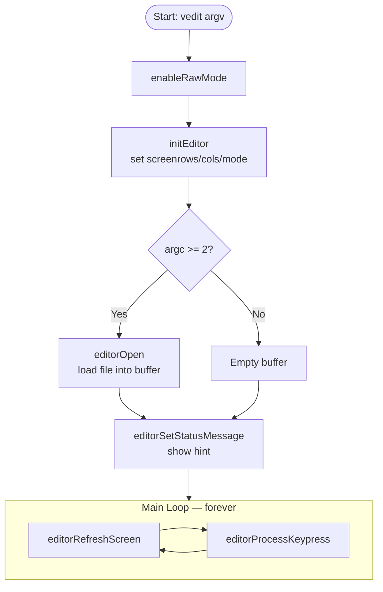

---

## 7. Input Pipeline

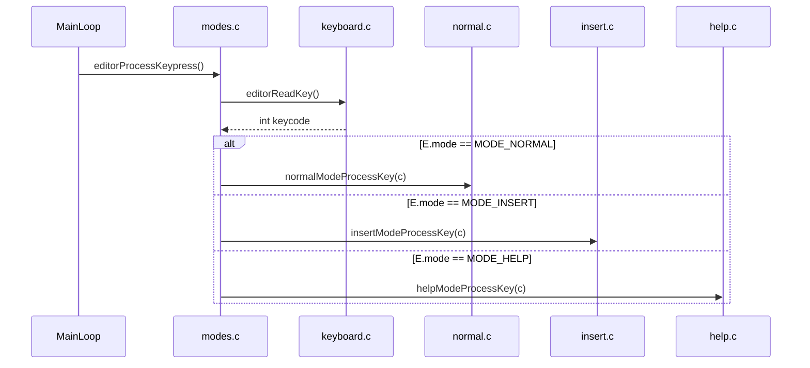

### Key Encoding (`keyboard.c`)

```mermaid
flowchart LR
    raw[Read 1 byte from STDIN] --> esc{byte == ESC?}
    esc -- No --> ret_char[Return char as-is]
    esc -- Yes --> read2[Read 2 more bytes]
    read2 --> bracket{seq[0] == '[' ?}
    bracket -- Yes --> digit{seq[1] 0-9?}
    digit -- Yes --> read3[Read seq[2]]
    read3 --> tilde{seq[2] == '~'?}
    tilde -- Yes --> map_ext[Map to HOME/DEL/END\nPAGE_UP/PAGE_DOWN]
    digit -- No --> map_arrow[Map to ARROW_UP/DOWN\nLEFT/RIGHT HOME END]
    bracket -- No --> O{seq[0] == 'O'?}
    O -- Yes --> map_O[Map HOME/END]
    O -- No --> ret_esc[Return ESC]
```

---

## 8. Normal Mode Key Handling

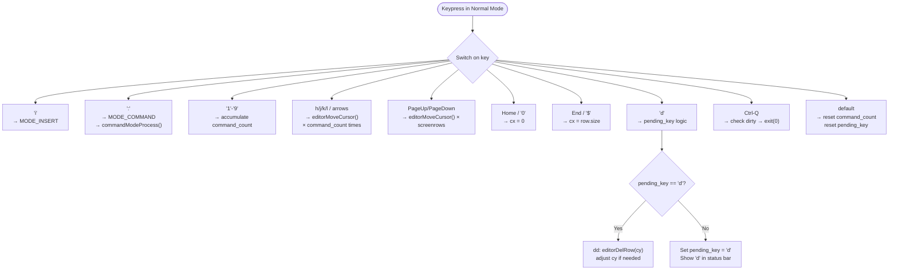

---

## 9. Insert Mode Key Handling

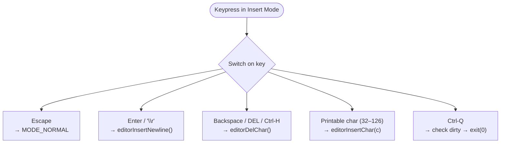

---

## 10. Command Mode Processing

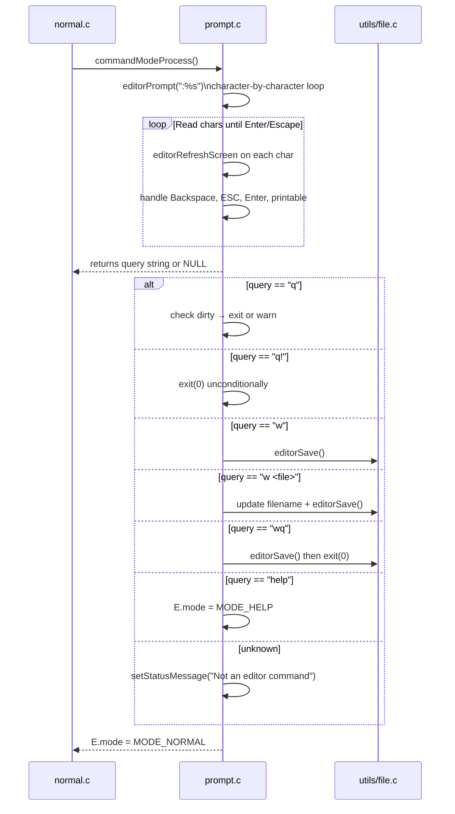

---

## 11. Buffer / Core Operations

### Row-level call graph

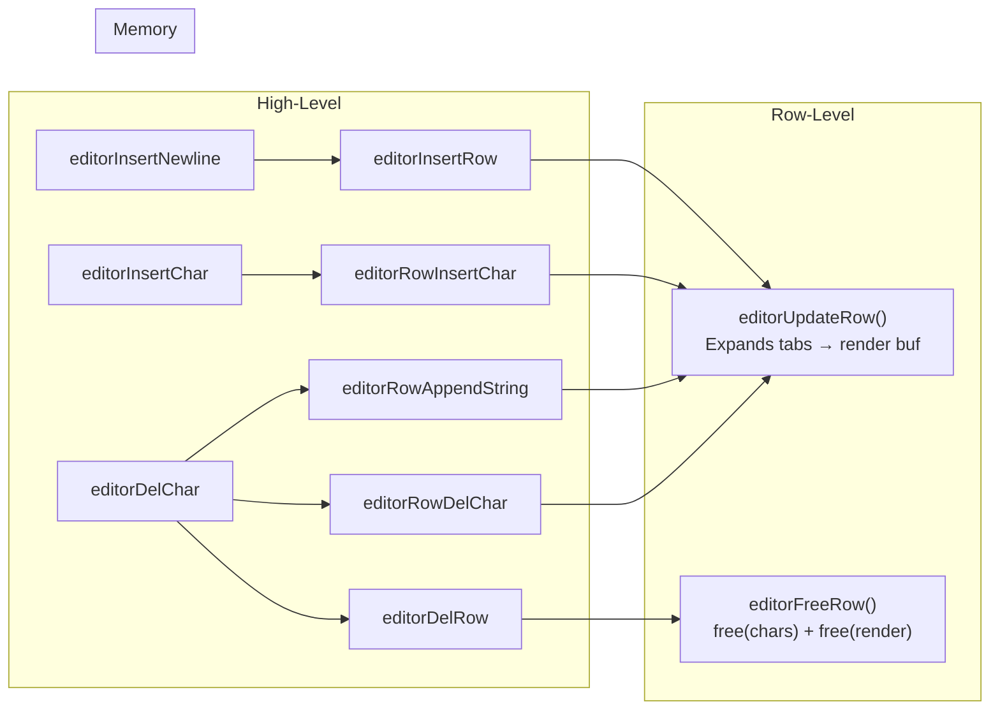

### Function Summary Table

| Function | File | Description |
|---|---|---|
| `editorUpdateRow(row)` | `buffer.c` | Rebuilds `row->render` expanding `\t` to spaces (tab stop = 8) |
| `editorInsertRow(at, s, len)` | `buffer.c` | Inserts a new row at position `at` in the global row array |
| `editorFreeRow(row)` | `buffer.c` | Frees `chars` and `render` of a row |
| `editorDelRow(at)` | `buffer.c` | Removes row at `at`, memmoves remaining rows up |
| `editorRowInsertChar(row, at, c)` | `buffer.c` | Inserts char at column `at` within a row |
| `editorRowAppendString(row, s, len)` | `buffer.c` | Appends a string to the end of a row (used when merging lines) |
| `editorRowDelChar(row, at)` | `buffer.c` | Deletes char at column `at` within a row |
| `editorInsertChar(c)` | `buffer.c` | High-level: insert char at cursor position |
| `editorInsertNewline()` | `buffer.c` | Splits current row at cursor or inserts blank row |
| `editorDelChar()` | `buffer.c` | High-level: delete char before cursor, merge lines if at col 0 |

---

## 12. UI Rendering Pipeline

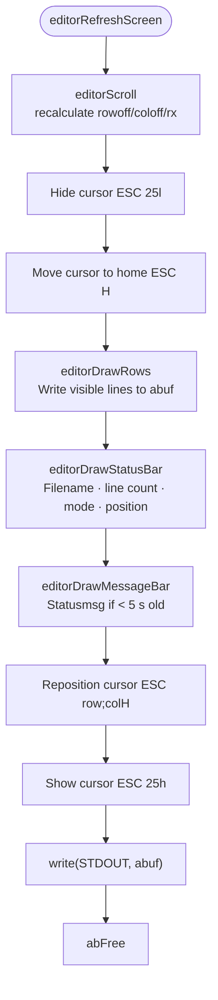

### Scroll Calculation (`editorScroll`)

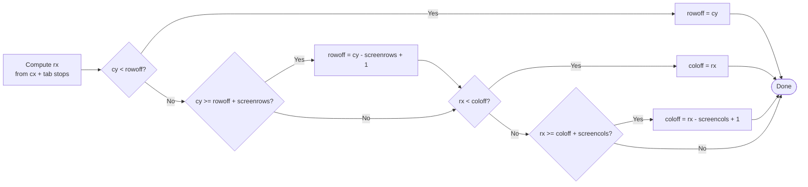

### Status Bar Layout

```
┌────────────────────────────────────────────────┐
│ filename.c - 42 lines (modified)  [INSERT] 10/42│
└────────────────────────────────────────────────┘
  ↑ left: filename + line count + dirty flag       ↑ right: [MODE] cur/total
```

---

## 13. File I/O Flow

### Open

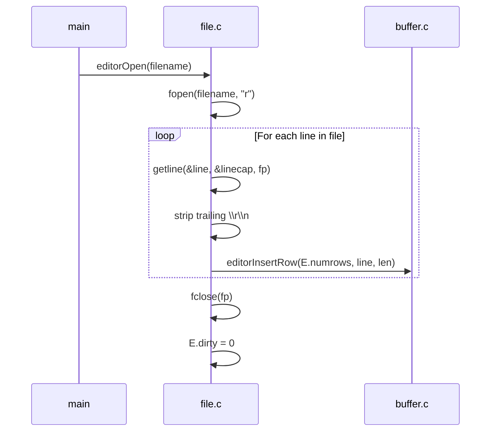

### Save

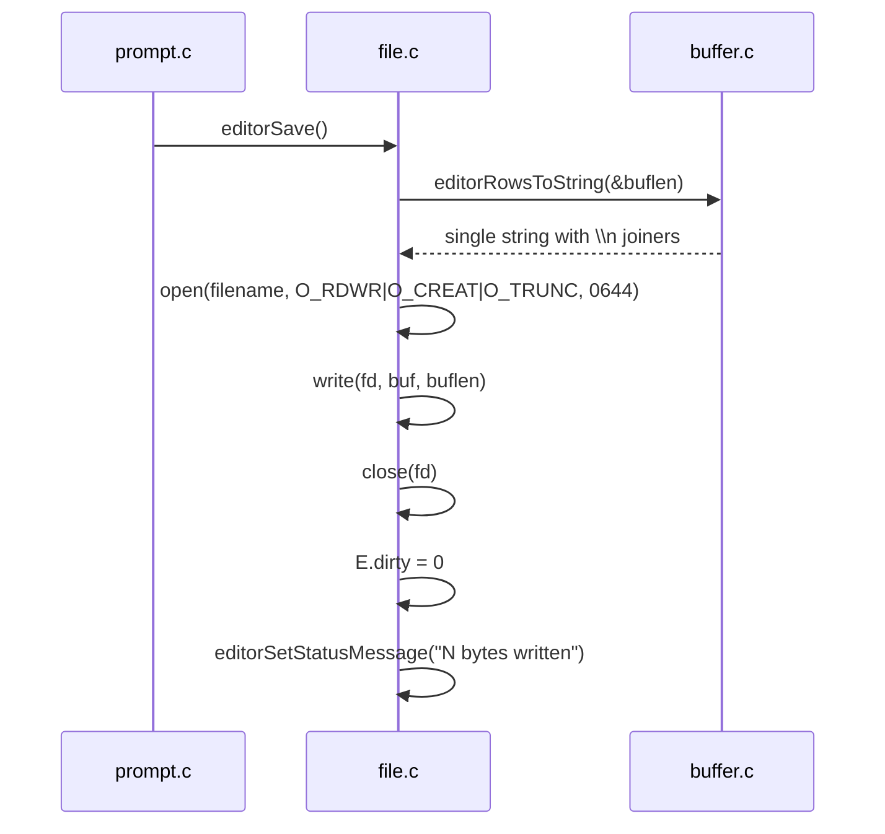

---

## 14. Build System

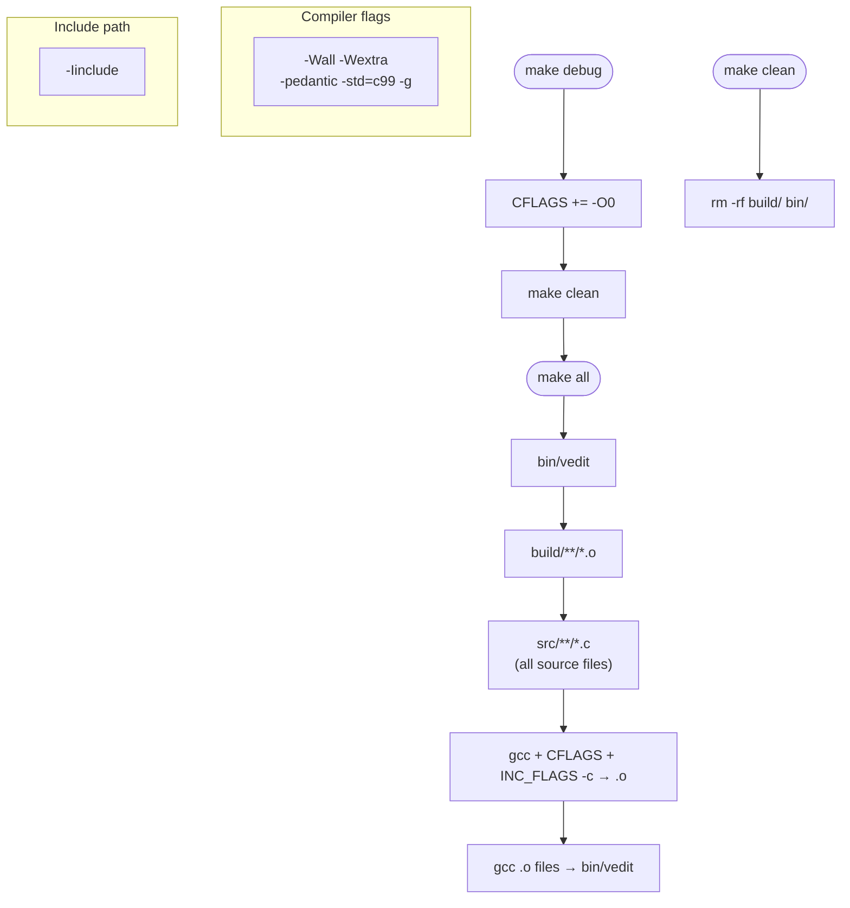

### Makefile Source Discovery

```makefile
SRC_DIR = src src/core src/ui src/input src/commands src/utils
SRCS    = $(foreach dir, $(SRC_DIR), $(wildcard $(dir)/*.c))
OBJS    = $(patsubst %.c, $(BUILD_DIR)/%.o, $(SRCS))
```

All `.c` files across every `SRC_DIR` subdirectory are automatically compiled; no manual source list needed.

---

## Key Bindings Summary

### Normal Mode

| Key | Action |
|---|---|
| `h / ←` | Move cursor left |
| `j / ↓` | Move cursor down |
| `k / ↑` | Move cursor up |
| `l / →` | Move cursor right |
| `0 / Home` | Beginning of line |
| `$ / End` | End of line |
| `PageUp` | Scroll up one screen |
| `PageDown` | Scroll down one screen |
| `[n]j` | Move `n` lines down (numeric prefix) |
| `dd` | Delete current line |
| `i` | Enter Insert mode |
| `:` | Enter Command mode |
| `Ctrl-Q` | Quit (with unsaved-changes check) |

### Insert Mode

| Key | Action |
|---|---|
| `Esc` | Return to Normal mode |
| `Enter` | Insert newline |
| `Backspace / Del` | Delete character before/at cursor |
| Any printable | Insert character at cursor |

### Command Mode (`:cmd`)

| Command | Action |
|---|---|
| `:w` | Save file |
| `:w <file>` | Save as named file |
| `:q` | Quit (blocked if unsaved) |
| `:q!` | Force quit |
| `:wq` | Save and quit |
| `:help` | Open Help screen |

### Help Mode

| Key | Action |
|---|---|
| `j / ↓` | Scroll help down |
| `k / ↑` | Scroll help up |
| `q / Esc / Enter` | Close help, return to Normal |
